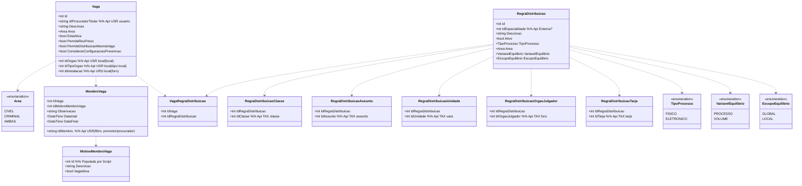

```mermaid
classDiagram
  Vaga ..> Area
  Vaga ..> MembroVaga
  Vaga ..> VagaRegraDistribuicao
  RegraDistribuicao ..> VagaRegraDistribuicao
  MembroVaga ..> MotivoMembroVaga
  RegraDistribuicao ..> RegraDistribuicaoClasse
  RegraDistribuicao ..> RegraDistribuicaoAssunto
  RegraDistribuicao ..> RegraDistribuicaoUnidade
  RegraDistribuicao ..> RegraDistribuicaoOrgaoJulgador
  RegraDistribuicao ..> RegraDistribuicaoTarja
  RegraDistribuicao ..> TipoProcesso
  RegraDistribuicao ..> VariavelEquilibrio
  RegraDistribuicao ..> EscopoEquilibrio

  class Vaga{
     +int Id     
     +int IdOrgao %% Api USR local (local)
     +int IdTipoOrgao %% Api USR local (tipo local)
     +int IdInstalacao %% Api URS local (foro)
     +string IdProcuradorTitular %% Api USR usuario
	 +string Descricao
     +Area Area
     +bool EstaAtiva
     +bool PermiteReuPreso
     +bool PermiteDistribuicaoMesmaVaga
     +bool ConsiderarConfiguracoesPrevencao
    }
    
    class MembroVaga {     
       +string IdMembro, %% Api USR (filtro: promotor/procurador)
       +int IdVaga
       +int IdMotivoMembroVaga
       +string Observacao
       +DateTime DataInial
       +DateTime DataFinal
    }
    
     class VagaRegraDistribuicao {
       +int IdVaga
       +int IdRegraDistribuicao
    }
    
   class RegraDistribuicao{
     +int Id
     +int IdEspecialidade %% Api Externa?
     +string Descricao
     +bool Ativo
     +TipoProcesso TipoProcesso
     +Area Area
     +VariavelEquilibrio VariavelEquilibrio
     +EscopoEquilibrio EscopoEquilibrio     
    }
    
    class RegraDistribuicaoClasse{
     +int IdRegraDistribuicao
     +int IdClasse %% Api TAX classe
    }

    class RegraDistribuicaoAssunto{
     +int IdRegraDistribuicao
     +int IdAssunto %% Api TAX assunto
    }
    
    class RegraDistribuicaoTarja{
     +int IdRegraDistribuicao
     +int IdTarja %% Api TAX tarja
    }

    class RegraDistribuicaoUnidade{
     +int IdRegraDistribuicao
     +int IdUnidade %% Api TAX vara
    }

    class RegraDistribuicaoOrgaoJulgador{
     +int IdRegraDistribuicao
     +int IdOrgaoJulgador %% Api TAX foro
    }

    class TipoProcesso{
        <<enumeration>>
        FISICO
        ELETRONICO
    }
    
    class VariavelEquilibrio{
        <<enumeration>>
        PROCESSO
        VOLUME
    }
    
    class Area{
      <<enumeration>>
      CIVEL
      CRIMINAL
      AMBAS
    }
    
    class EscopoEquilibrio{
        <<enumeration>>
        GLOBAL
        LOCAL
    }
    
    class MotivoMembroVaga{
        +int Id %% Populada por Script
        +string Descricao
        +bool VagaAtiva
    }
```